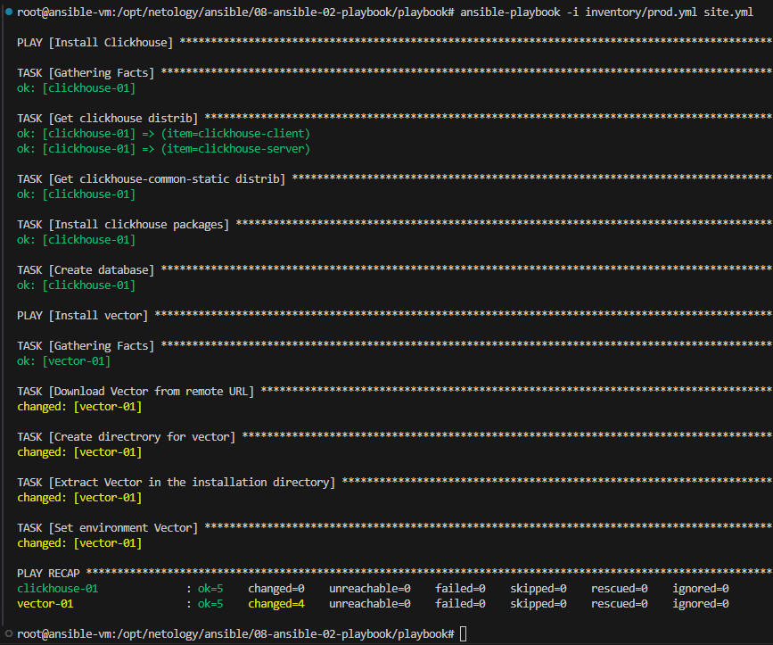
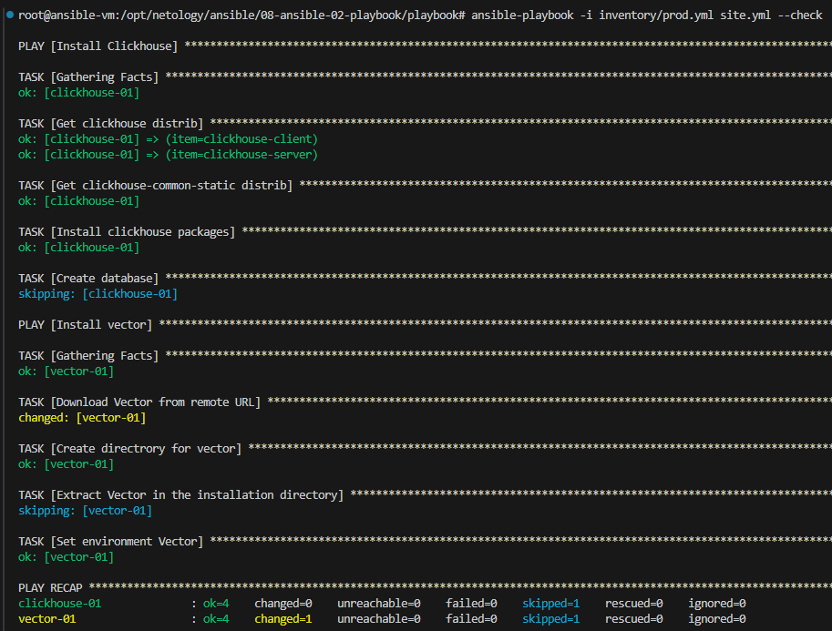
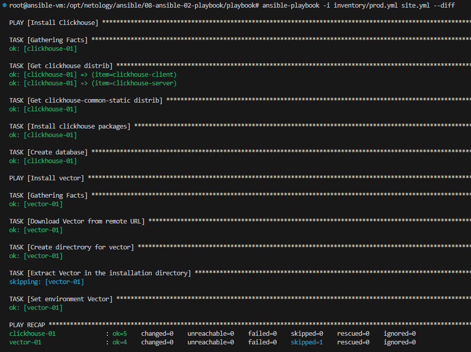
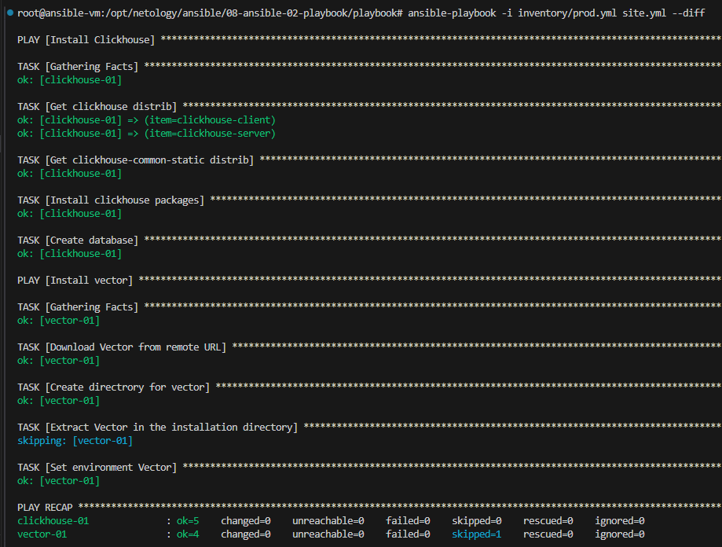

# Домашнее задание к занятию 2 «Работа с Playbook»

## Основная часть

> Запустите `ansible-lint site.yml` и исправьте ошибки, если они есть.

> Попробуйте запустить playbook на этом окружении с флагом `--check`.

> Запустите playbook на `prod.yml` окружении с флагом `--diff`. Убедитесь, что изменения на системе произведены.

>Повторно запустите playbook с флагом `--diff` и убедитесь, что playbook идемпотентен.

---

Описание

### Download Vector from remote URL (Скачать Vector из удаленного URL):
Задача get_url загружает архив с программой Vector по указанному URL.
URL составляется динамически с использованием переменных vector_version и vec_arc_var, что позволяет получать архив нужной версии и для нужной архитектуры.
Архив сохраняется во временной директории /tmp

### Create directory for vector (Создать каталог для Vector):
Задача file создает директорию для установки Vector, используя указанную переменную vector_dir.
Если директория уже существует, она пропускается.
Extract Vector in the installation directory (Распаковать Vector в установочную директорию):

### Задача unarchive распаковывает скачанный архив с Vector в установленную директорию.
В параметре extra_opts указывается дополнительная опция --strip-components=2, чтобы извлечь содержимое архива, игнорируя два верхних каталога.
Проверка наличия файла vector в директории происходит с помощью параметра creates, что позволяет Ansible определить, были ли изменения.
Set environment Vector (Установить окружение Vector):

### Задача template использует файл шаблона vector.toml.j2 для создания конфигурационного файла vector.toml.
Этот файл помещается в установленную директорию {{ vector_dir }}.
