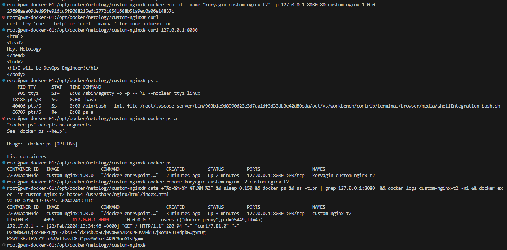
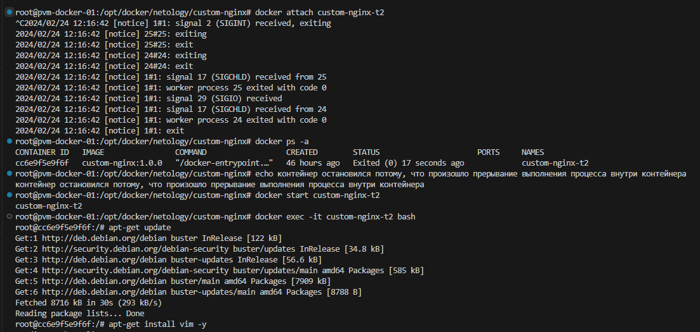
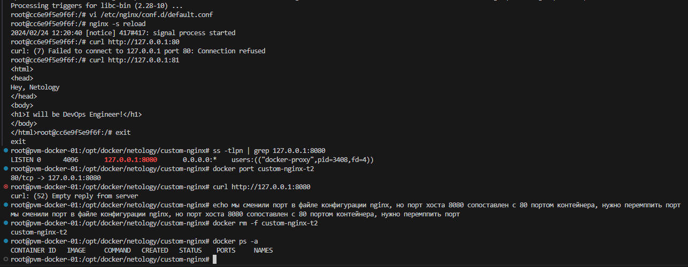
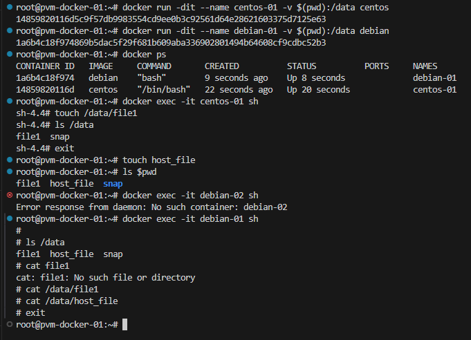
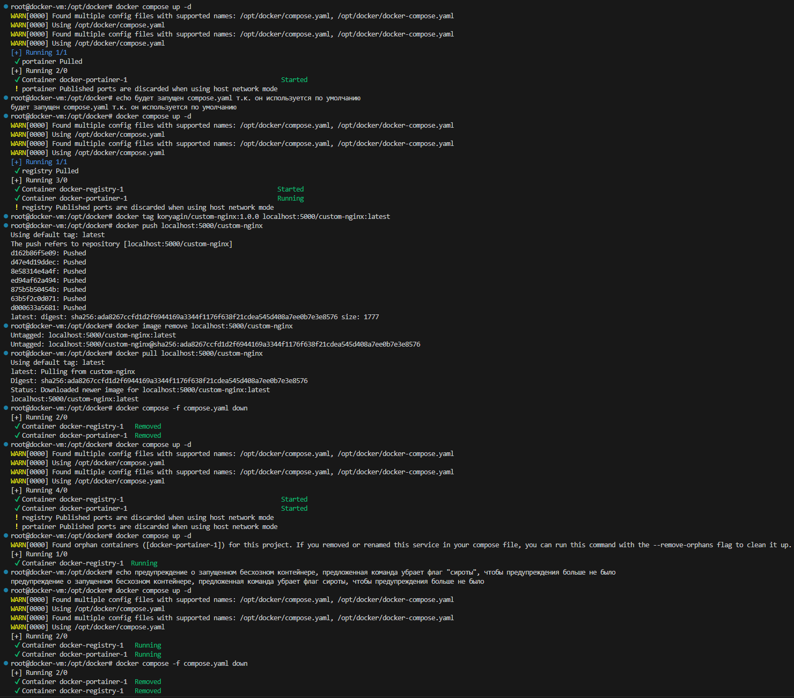
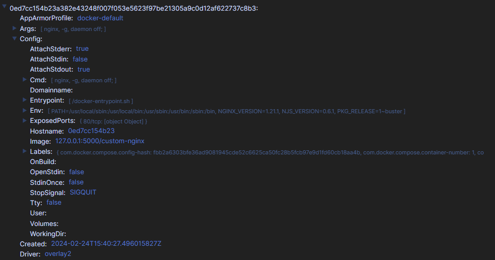

# Выполнение задания: Оркестрация группой Docker контейнеров на примере Docker Compose
## Выполнил Корягин Алексей

### Задача 1
В ходе выполнения задания была зарегистрирована учетная запись для DockerHub и опубликован образ с тегом 1.0.0

<a href="https://hub.docker.com/repository/docker/koryagin/custom-nginx/general">Ссылка на репозиторий</a>

### Задача 2

### Задача 3
> Выполните docker ps -a и объясните своими словами почему контейнер остановился.

Контейнер остановился из-за прерывания основного процесса, если завершается основной процесс контейнера, то контейнер останавливается

> Это дополнительное, необязательное задание. Попробуйте самостоятельно исправить конфигурацию контейнера, используя доступные источники в интернете. Не изменяйте конфигурацию nginx и не удаляйте контейнер. Останавливать контейнер можно

### Задача 4

### Задача 5
> Выполните команду "docker compose up -d". Какой из файлов был запущен и почему?

Выполнился compose.yaml т.к. он является файлом по умолчанию (предпочтительным), docker-compose.yaml используется для обратной совместимости более ранних версий.

