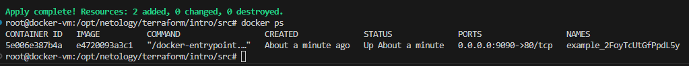
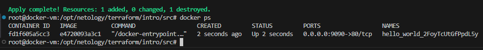
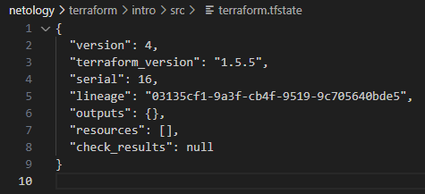

# Выполнение задания: «Введение в Terraform»
### Задача 1
> Изучите файл .gitignore. В каком terraform-файле, согласно этому .gitignore, допустимо сохранить личную, секретную информацию?

.gitignore показывает, что допустимо сохранять личные, секретные информации в файле personal.auto.tfvars.

### Задача 2
> Выполните код проекта. Найдите в state-файле секретное содержимое созданного ресурса random_password, пришлите в качестве ответа конкретный ключ и его значение.

**"result": "2FoyTcUtGfPpdL5y"**

### Задача 3
> Раскомментируйте блок кода, примерно расположенный на строчках 29–42 файла main.tf. Выполните команду terraform validate. Объясните, в чём заключаются намеренно допущенные ошибки. Исправьте их.

Строка 24, ошибка заключается в том, что не указан обязательный атрибут "name"

**resource "docker_image" "nginx"**

строка 29, Имя должно начинаться с буквы или символа подчеркивания и может содержать только буквы, цифры, символы подчеркивания и тире.

**resource "docker_container" "nginx_container"**

Строка 31, не объявленна "random_string_FAKE" в данном коде используется строка "random_string" для ресурса "random_password"
также исправлена опечатка resulT на result

**name  = "example_${random_password.random_string.result}"**

### Задача 4
> Выполните код. В качестве ответа приложите: исправленный фрагмент кода и вывод команды docker ps

### Задача 5
> Замените имя docker-контейнера в блоке кода на hello_world. Не перепутайте имя контейнера и имя образа. Мы всё ещё продолжаем использовать name = "nginx:latest". Выполните команду terraform apply -auto-approve. Объясните своими словами, в чём может быть опасность применения ключа -auto-approve. Догадайтесь или нагуглите зачем может пригодиться данный ключ? В качестве ответа дополнительно приложите вывод команды docker ps.

Опция **-auto-approve** предотвращает запрос подтверждения перед применением изменений, что может быть опасным, поскольку изменения могут влиять на ваш инфраструктурный стек. Например, она может привести к удалению ресурсов без предварительного подтверждения.
Чтобы предотвратить неожиданные изменения, рекомендуется тщательно рассмотреть план Terraform перед его применением и убедиться, что все изменения соответствуют нашим ожиданиям.

Опция **-auto-approve** полезна в сценариях автоматизации, например, при использовании Terraform в пайплайнах CI/CD, где подтверждение пользователя может быть неудобным или невозможным.

### Задача 6
>Уничтожьте созданные ресурсы с помощью terraform. Убедитесь, что все ресурсы удалены. Приложите содержимое файла terraform.tfstate.

### Задача 7
> Объясните, почему при этом не был удалён docker-образ nginx:latest. Ответ ОБЯЗАТЕЛЬНО НАЙДИТЕ В ПРЕДОСТАВЛЕННОМ КОДЕ, а затем ОБЯЗАТЕЛЬНО ПОДКРЕПИТЕ строчкой из документации terraform провайдера docker. (ищите в классификаторе resource docker_image )

При уничтожении ресурсов Terraform по умолчанию не удаляет Docker-образы, так как они могут быть использованы другими контейнерами или в других сценариях.
В описании ресурса образа есть настройка удержания образа

<a href=https://docs.comcloud.xyz/providers/kreuzwerker/docker/latest/docs/resources/image#keep_locally>keep_locally</a> (Логическое значение) Если true, то Docker образ не будет удален при операции уничтожения. Если это значение равно false, изображение будет удалено из локального хранилища docker при операции уничтожения.
